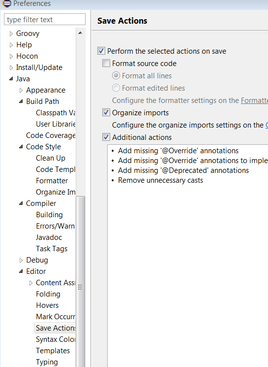
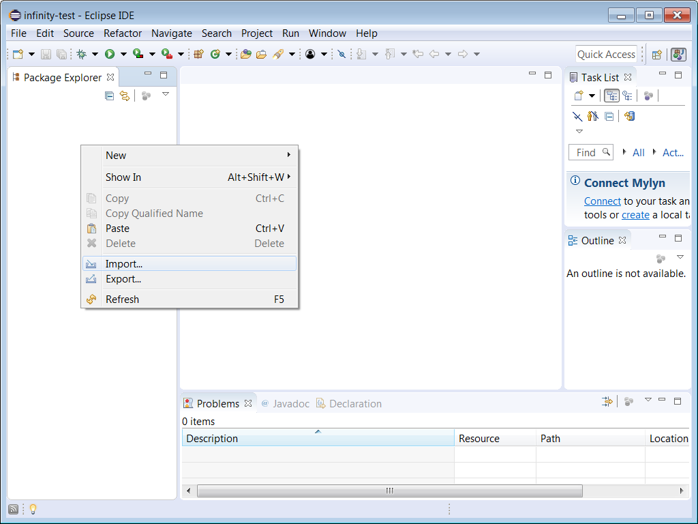
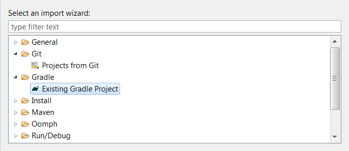
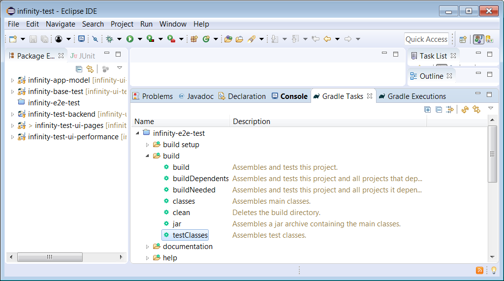
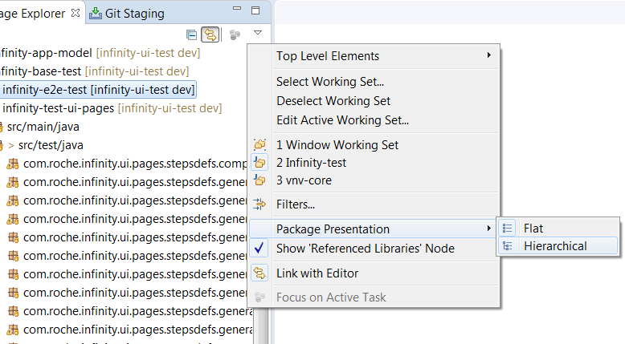
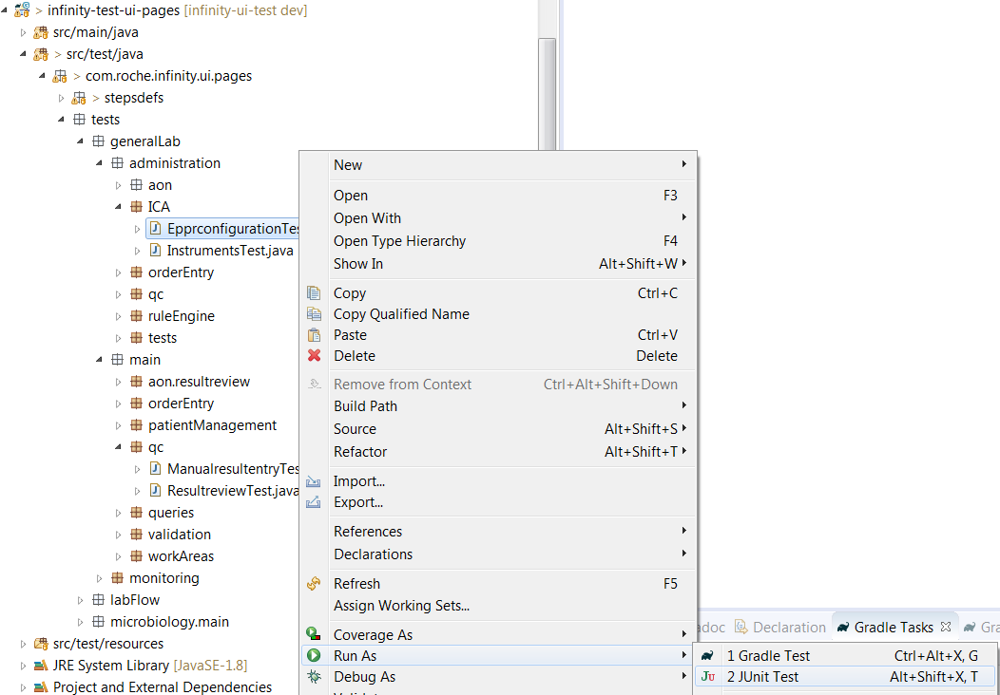
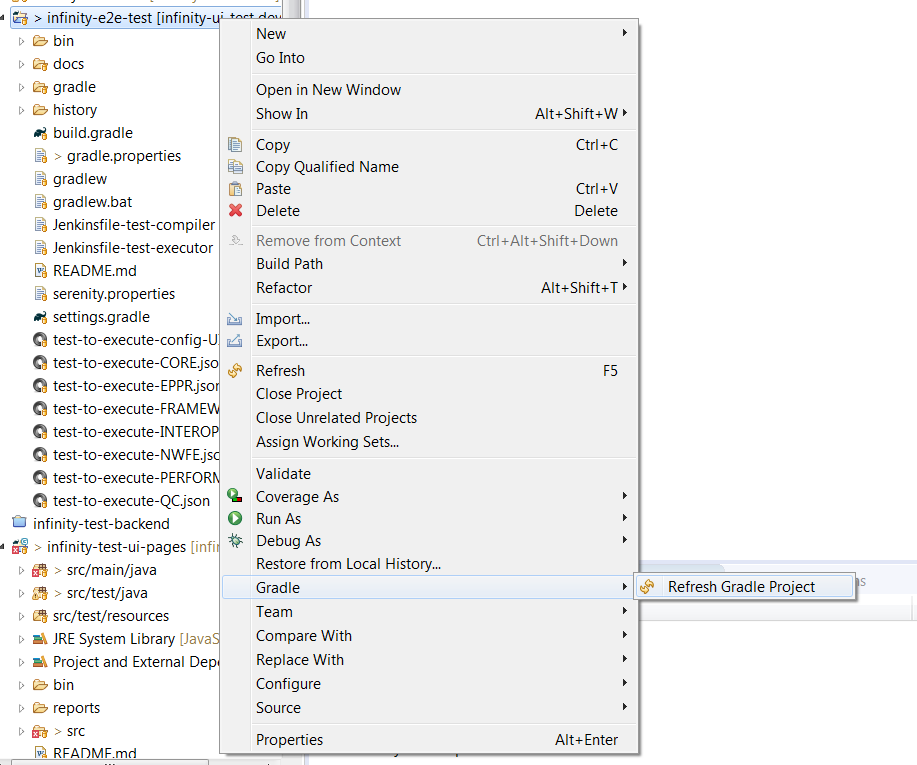

# Eclipse configuration

## Requirements
* Download from [Artifactory](http://repository.kiosk.roche.com:80/infinity-resources-local/IDE/eclipse.2018-09.zip)
* Unzip and startup _eclipse.exe_
* Choose a folder for your workspace

## Initial steps
* Configure "autosave" by open _window/preferences_, and then:
 

* Import Project
 

* Import Gradle project with the default options:
 

* To verify that we are up to date with all the dependencies, that all compiles oK and to generate the Test runners, execute the Gradle task _testClasses_:
 

* Change package presentation:
 
 
## Running the tests
* In src\test\java\tests\... you will find the jUnit classes to execute the tests. Those classes are automatically generated after execute the gradle task _testClasses_ 
 
  
## Update project
* If something is changed in the project, you can refresh the Gradle configuration by:

## Tutorials
See https://www.udemy.com/eclipse-java-tutorial-for-beginners/

| Shortcut     | Description                                                                    |
|--------------|--------------------------------------------------------------------------------|
| Alt+Shift+R  | Rename                                                                         |
| Ctrl+1       | Quickfix; shows potential fixes for warnings, errors or shows possible actions |
| Ctrl+Space   | Content assist/ code completion                                                |
| Ctrl+D       | Deletes current line in the editor                                             |
| Ctrl+Q       | Goes to the last edited position                                               |
| Alt+Shift+L  | Extract local variable                                                         |
| Ctrl+Shift+F | Format source code                                                             |
| Ctrl+Alt+H   | Opens call hierarchy                                                           |
| Shift+Alt+UP | Selects enclosing elements. Result depending on cursor position                |
| Ctrl+F       | Opens the find dialog                                                          |
| Ctrl+Shift+R | Opens the resource dialog                                                      |
| Ctrl+Shift+F | format code                                                                    |
| Alt+Shift+S  | generate getters / setters                                                     |
| Ctrl+Alt+G   | find usages                                                                    |
