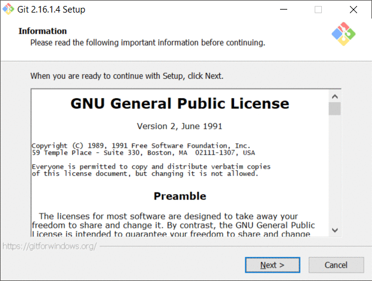

# Git Best practices

## Tools

It is really easy to setup git on windows. Just download it using this [link](https://git-scm.com/) and go through the default installation process.

Possible tools to use:
* [git-fork](https://git-fork.com/) ==>> very cool resolving conflicts!
* [SourceTree](https://www.sourcetreeapp.com/)

### Branches
 There will those types of branches:
 * feature
 * hotfix
 * bugfix
 * release

## Update local branch before push

1. From your "feature/team/name" branch: commit your changes to the task branch: `git commit -am 'Add some feature'`
2. Rebase or Pull "origin/master" to "local/feature/..."
3. Push local to origin with force (if needed)
7. Submit a pull request
