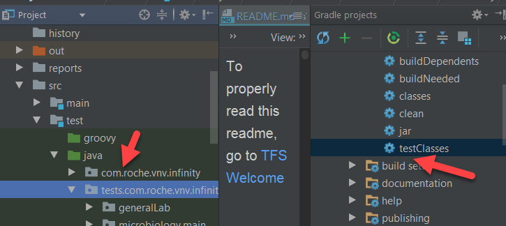
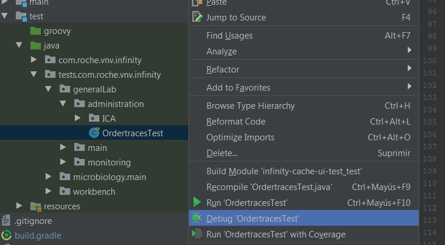
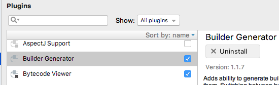
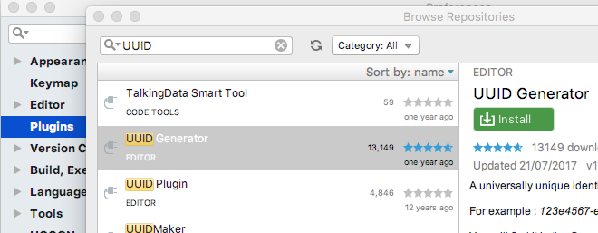
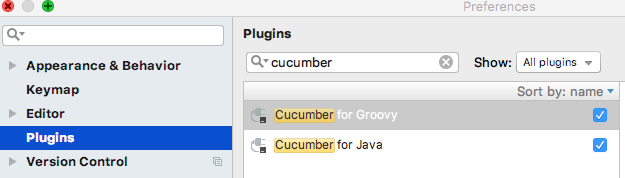
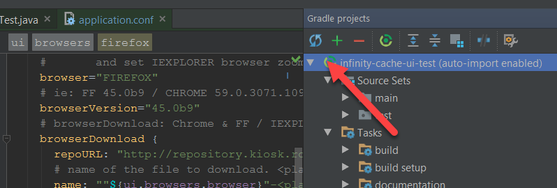
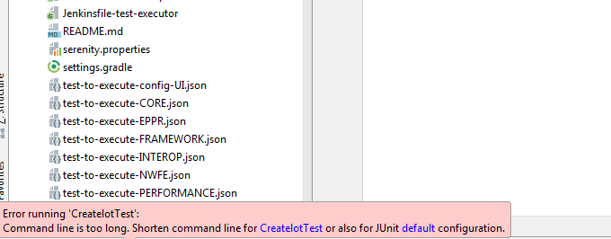

# intelliJ

## Requirements
* Java JDK 8 installed
* IntelliJ installed

## Initial steps
* Import Project as Gradle with the default config. 
 * To verify that we are up to date with all the dependencies, that all compiles oK and to generate the Test runners, execute the Gradle task _testClasses_:
 
 
 
## Running the tests
* In src\test\java\tests\... you will find the jUnit classes to execute the tests. Those classes are automatically generated after execute the gradle task _testClasses_

 

## Plugins

* Builder Generator

   

* UUID Generator

   

* Cucumber

   

## Update IDE:     
* Refresh project:

 
 
## Troubleshooting & FAQ
- Trying to execute a test get this error: "Command line too long"

Then click on "Default Junit config" and set  __Shorten Command="JAR manifest" __

## Tutorials
See https://www.jetbrains.com/help/idea/mastering-keyboard-shortcuts.html
 